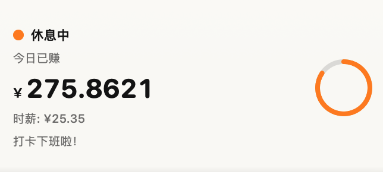
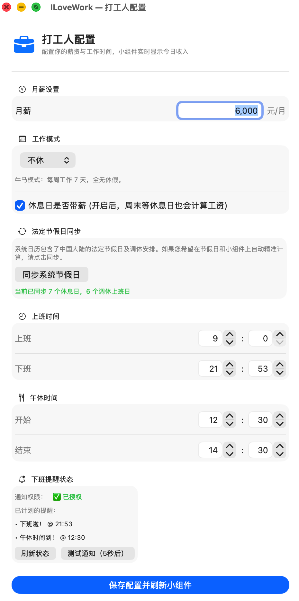
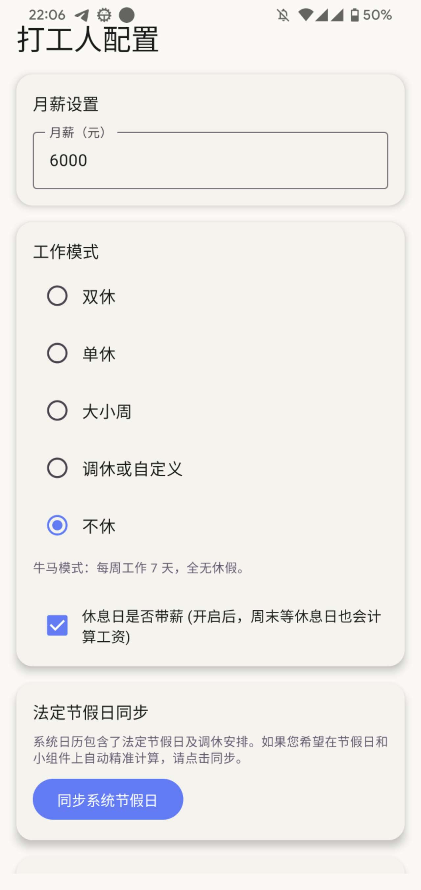

# 我爱上班 (ILoveWork) 💼💰

**“我爱上班”** 是一款专为打工人量身定制的薪资计算与提醒工具。它能够在你的桌面和手机屏幕上实时显示你今天赚了多少钱，并精确倒计时下班时间，为你枯燥的打工生活注入一点乐趣和动力！

该项目跨平台支持 **macOS** 和 **Android**，核心逻辑高度一致，并提供了各个平台的原生桌面小组件体验。

---

## ✨ 核心功能

*   **💰 实时薪资跳动：** 输入你的月薪和工作时间，应用会精确计算你的“秒薪”，在小组件上实时看着钱一点点进账。
*   **⏱ 下班倒计时：** 精确到分钟的下班倒计时，告诉你还要熬多久才能解放。
*   **🔔 上下班/午休提醒：** 
    *   到了下班时间，准时弹出系统级消息通知（再也不用担心错过下班！）。
    *   支持午休提醒设置，中午准点提醒休息。
*   **📱 桌面小组件 (Widget)：**
    *   **macOS：** 支持大/小尺寸的桌面小组件，主程序在后台运行时支持高频刷新，实时掌握薪资动态。
    *   **Android：** 原生桌面微件支持，同样可以放在桌面随时查看。
*   **⚙️ 灵活的排班配置：** 
    *   自定义上下班时间、午休时间。
    *   支持配置每周哪些天是工作日、带薪休息日或无薪休息日。

---

## 📸 界面预览

### macOS 端

  
  

### Android 端

  
  

---

## 🛠 技术栈

本项目为双端原生应用，采用分离的 UI 架构与共享的业务逻辑模型：

### 🍎 macOS 端
*   **语言：** Swift
*   **UI 框架：** SwiftUI
*   **小组件：** WidgetKit (支持 macOS 桌面小组件，使用纯静态渲染结合 Timeline 高频刷新策略)
*   **通知：** UserNotifications (`UNUserNotificationCenter` 实现本地定时通知)
*   **存储：** UserDefaults / App Group

### 🤖 Android 端
*   **语言：** Kotlin
*   **UI 框架：** Jetpack Compose
*   **小组件：** AppWidgetProvider & Glance (或自定义 RemoteViews)
*   **通知与调度：** AlarmManager & BroadcastReceiver (实现精准的下班与午休提醒)
*   **存储：** DataStore / SharedPreferences

---

## 🚀 编译与运行

### macOS 端
1. 使用 Xcode 打开 `macosApp/macosApp.xcodeproj`（或 `.xcworkspace`）。
2. 在 `Signing & Capabilities` 中配置你的开发者账号。
3. 确保开启了 **App Groups** 和 **User Notifications** 权限。
4. 选择目标设备为你的 Mac，点击 Run (⌘+R) 即可编译运行。
5. **添加小组件：** 在 macOS 桌面右键 -> 编辑小组件 -> 搜索 "ILoveWork" -> 拖拽到桌面。

### Android 端
1. 使用 Android Studio 打开 `androidApp` 目录。
2. 同步 Gradle 项目。
3. 连接你的 Android 手机或启动模拟器。
4. 点击 Run (Shift+F10) 编译并安装到设备上。
5. **添加小组件：** 在手机桌面长按 -> 小部件 -> 找到“我爱上班” -> 拖拽到桌面。

---

## 💡 使用说明与常见问题

*   **macOS 通知没有弹出来？**
    请前往 macOS 的 `系统设置 -> 通知 -> 我爱上班`，确保已经勾选了**“允许通知”**。主界面中的“下班提醒状态”面板可以帮你测试通知是否正常工作。
*   **macOS 小组件的倒计时没有每秒刷新？**
    由于 macOS WidgetKit 的系统级限制，小组件默认无法实现精确到秒的渲染。我们采用了高频重新加载 Timeline 的策略，当主 App 处于前台运行时，小组件会高频（如每 5 秒）刷新一次数据。
*   **Android 端的下班提醒不准时？**
    请前往手机设置中，将本应用加入**“电池优化白名单”**，并允许后台运行，以确保 AlarmManager 能够准时唤醒应用发送通知。

---

## 📝 许可协议

本项目仅供学习与娱乐使用。祝大家都能按时下班，薪水多多！🎉